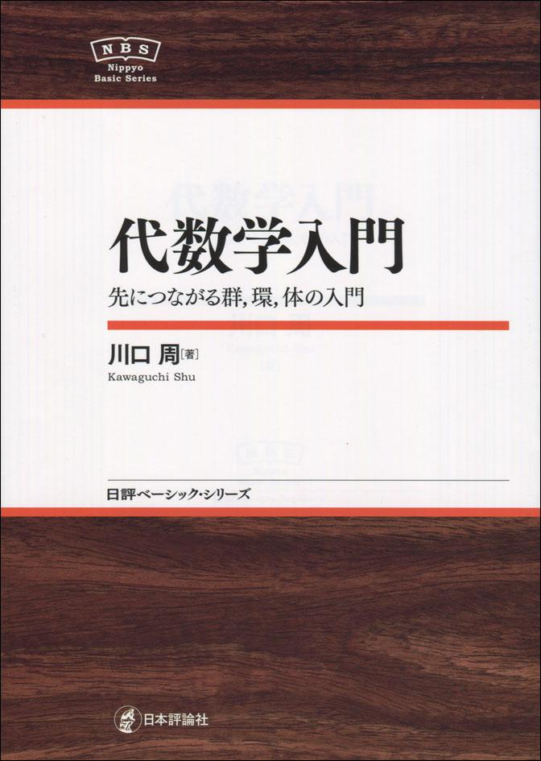
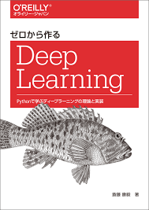

# yonda-books
読んだ本の記録

## 9割読んだ

### 代数学入門

- **日本評論社** 
- **川口 周**
- **メモ: 初心者向け．準同型定理　中国剰余定理**

## 半分読んだ

### 体とガロア理論

- **東京大学出版会**
- **桂 利行**
- **メモ: ガロアの基本定理**

### ゼロから作るDeep Learning

- **オライリージャパン**
- **斎藤 康毅**
- **メモ: AI**

